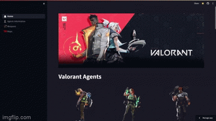
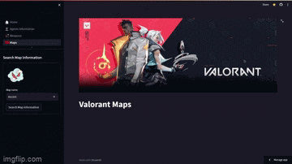
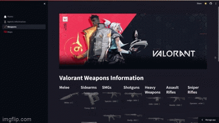
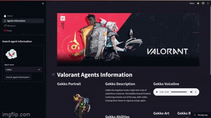

# Valorant Showcase 
## App Link : [Valorant Showcase](https://valorant-showcase.streamlit.app/)


## Description
This Streamlit Web Application is a showcase of Riot's FPS game " Valorant " basic information such as Agents, Abilities, Maps by pulling data from two resources, a VALORANT endpoint API and scrapping a [valorant fandom website](https://valorant.fandom.com/wiki/VALORANT_Wiki).

Notably, it offers the user the ability to browse through the game's various agents, search for a specific agent to display their information such as : 
- Full Portrait 
- Description
- Role
- Abilities
- Featured Art 

Addiotionally, just like Agents browsing, this web app offers Maps browsing. Once you chose a map, you will gain numerous insights on : 
- Map Illustration 
- Mini-Map 
- Map description
- Map release date
- Location + Coordinates
- Country inspiration 
- Map theme 
## Gifs 

Agents          |  Maps | Guns
:-------------------------:|:-------------------------:|:-------------------------:
 |  | 

## Required packages
-Streamlit 
-lxml
-Requests
-beautifulsoup4

## Installation
to install the required packages you can run :

```bash
 pip install -r requirements.txt

```

## How to run the App locally
I encourage you clone this repository, check the source code behind the web app,make a pull request and modify it to your liking. To do so you can follow these steps :
1. Clone or download this repository  
2. Inside the repository you just downloaded/cloned, open your terminal 
3. Run `Streamlit run 🏠_Home.py ` (you can copy the filename to avoid emoji placing )

## Known issues (Work in progress)
- The app runtime is a bit slow because it is making an api call to  two online data-sources to display the information and not a database

## Incoming 
- Include more maps insights
    - Team deathmatch maps
    - The Range
- Include Agents Display Through Roles
- Include Buddies page
## Find a bug ?
Don't hesitate to make a pull request or issue the bug in the according box above, that would be much appreciated and help me become a better programmer 😁


